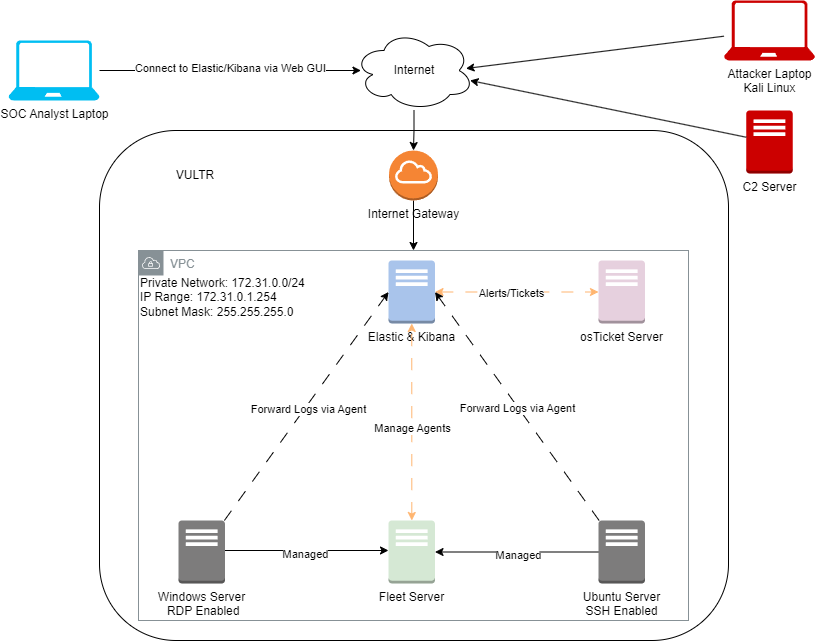

# SOC Setup Project: Enhanced Cybersecurity Monitoring and Response

## Table of Contents
- [Project Overview](#project-overview)
- [Technologies Used](#technologies-used)
- [Daily Activities, Skills, and Outcomes](#daily-activities-skills-and-outcomes)
- [Conclusion](#conclusion)
- [License](#license)

## Project Overview
This project involves the implementation of a Security Operations Center (SOC) environment using the ELK Stack (Elasticsearch, Logstash, Kibana), Elastic Agents, and a ticketing system (osTicket) to enhance cybersecurity monitoring and incident response capabilities. The objective is to create a robust infrastructure for log collection, threat detection, and incident management.

## Technologies Used
- **ELK Stack**: Elasticsearch, Logstash, Kibana
- **Elastic Agent**: Unified agent for log collection
- **Fleet Server**: Centralized management for Elastic Agents
- **Sysmon**: System monitoring tool for Windows
- **Mythic C2**: Command-and-Control framework for simulation
- **osTicket**: Open-source ticketing system for incident management
- **Vultr**: Cloud platform for deployment
- **Debian & Windows Server 2022**: Operating systems used

## Daily Activities, Skills, and Outcomes

### Day 1: Create Logical SOC Diagram
- **Activity**: Designed a logical diagram illustrating the SOC architecture and data flow.
- **Skills Acquired**: Diagramming and architectural design.
- **Outcome**: A visual representation to guide the implementation of the SOC setup.

### Day 2: Learn About ELK Stack
- **Activity**: Researched the components of the ELK stack (Elasticsearch, Logstash, Kibana).
- **Skills Acquired**: Understanding of log management systems and their benefits.
- **Outcome**: Gained foundational knowledge necessary for implementing ELK stack components.

### Day 3: Spin Up Elasticsearch Instance
- **Activity**: Deployed an Elasticsearch instance on Vultr within a Virtual Private Cloud (VPC).
- **Skills Acquired**: Cloud infrastructure deployment, configuration management.
- **Outcome**: Established a centralized log repository for further analysis.

### Day 4: Install Kibana Instance
- **Activity**: Installed and configured Kibana to connect with the Elasticsearch instance.
- **Skills Acquired**: Frontend visualization tools setup, user authentication.
- **Outcome**: Created a platform for visualizing and analyzing log data.

### Day 5: Setup Windows Server 2022
- **Activity**: Installed and configured Windows Server 2022.
- **Skills Acquired**: Server configuration, security hardening.
- **Outcome**: Prepared the server for subsequent installations of monitoring tools.

### Day 6: Learn About Elastic Agent and Fleet Server
- **Activity**: Researched functionalities of Elastic Agents and Fleet Server.
- **Skills Acquired**: Knowledge of endpoint management and data collection.
- **Outcome**: Prepared for the deployment of agents for centralized data collection.

### Day 7: Install Elastic Agent on Windows Server
- **Activity**: Deployed Elastic Agent on Windows Server and enrolled it in Fleet.
- **Skills Acquired**: Agent installation and configuration.
- **Outcome**: Enabled data collection from the Windows Server to Elasticsearch.

### Day 8-9: Setup Sysmon for Logging
- **Activity**: Installed and configured Sysmon for system event logging.
- **Skills Acquired**: Advanced log collection techniques.
- **Outcome**: Enhanced visibility into system activities through detailed logs.

### Day 10: Ingest Sysmon and Windows Defender Logs
- **Activity**: Configured Logstash to ingest logs from Sysmon and Windows Defender.
- **Skills Acquired**: Log parsing and transformation.
- **Outcome**: Centralized relevant security logs for monitoring and analysis.

### Day 11: Research Brute Force Attacks
- **Activity**: Studied types of brute force attacks and preventive measures.
- **Skills Acquired**: Threat analysis and mitigation strategies.
- **Outcome**: Gained insights into defending against common attack vectors.

### Day 12: Set Up SSH Server and Monitor Logs
- **Activity**: Deployed an SSH server and monitored authentication logs.
- **Skills Acquired**: Log analysis and security monitoring.
- **Outcome**: Identified potential security threats from failed login attempts.

### Day 13: Install Elastic Agent on SSH Server
- **Activity**: Installed Elastic Agent on the SSH server for log collection.
- **Skills Acquired**: Endpoint data integration.
- **Outcome**: Extended data collection to include SSH access logs.

### Day 14: Create Alerts for Authentication Activity
- **Activity**: Developed alerts and dashboards for authentication activity.
- **Skills Acquired**: Alerting mechanisms and dashboard design.
- **Outcome**: Improved incident detection capabilities for unauthorized access.

### Day 15: Analyze RDP Risks
- **Activity**: Researched RDP vulnerabilities and protection measures.
- **Skills Acquired**: Understanding of remote access protocols and their risks.
- **Outcome**: Established best practices for securing remote access services.

### Day 16: Create Alerts for Brute Force Attempts
- **Activity**: Set up alerts for brute force attempts on SSH and RDP servers.
- **Skills Acquired**: Proactive monitoring and incident response.
- **Outcome**: Enhanced threat detection for brute force attacks.

### Day 17: Update Dashboards with Visualization
- **Activity**: Enhanced Kibana dashboards with geographical visualizations.
- **Skills Acquired**: Data visualization techniques.
- **Outcome**: Better contextual understanding of authentication attempts based on geography.

### Day 18: Introduction to Command-and-Control (C2)
- **Activity**: Researched C2 operations and their significance in cyber attacks.
- **Skills Acquired**: Understanding of adversarial techniques and behaviors.
- **Outcome**: Gained knowledge of how attackers maintain control over compromised systems.

### Day 19: Create Attack Diagram Using MITRE Framework
- **Activity**: Developed an attack diagram based on the MITRE framework.
- **Skills Acquired**: Mapping attacks to established frameworks.
- **Outcome**: Created a structured approach to analyze and replicate attack scenarios.

.jpg)

### Day 20: Setup Mythic Server
- **Activity**: Installed and configured the Mythic C2 framework.
- **Skills Acquired**: C2 framework setup and configuration.
- **Outcome**: Established a controlled environment for simulating attacks.

### Day 21: Perform Brute Force Attack Simulation
- **Activity**: Conducted a simulated brute force attack using Kali tools.
- **Skills Acquired**: Attack simulation and post-exploitation techniques.
- **Outcome**: Learned how to establish and maintain a foothold in a compromised system.

### Day 22: Create Alerts Based on Mythic Activity
- **Activity**: Developed alerts in Kibana based on Mythic telemetry.
- **Skills Acquired**: Event correlation and alerting.
- **Outcome**: Enhanced incident detection capabilities based on C2 activity.

### Day 23: Introduction to Ticketing Systems
- **Activity**: Researched the role of ticketing systems in incident management.
- **Skills Acquired**: Understanding of workflow management tools.
- **Outcome**: Gained insights into streamlining incident response processes.

### Day 24: Setup and Configure osTicket
- **Activity**: Deployed osTicket for incident management.
- **Skills Acquired**: Ticketing system installation and configuration.
- **Outcome**: Implemented a structured approach to track and manage security incidents.

### Day 25: Integrate osTicket with ELK Stack
- **Activity**: Configured integration between osTicket and the ELK stack.
- **Skills Acquired**: API integration and automation of workflows.
- **Outcome**: Automated incident tracking for alerts generated in the ELK stack.

### Day 26-29: Incident Analysis and Response
- **Activity**: Analyzed and responded to brute force attacks and Mythic telemetry.
- **Skills Acquired**: Threat hunting and incident response.
- **Outcome**: Improved detection and response capabilities for ongoing threats.

## Conclusion
This SOC setup project successfully demonstrated the integration of various cybersecurity tools to enhance monitoring and incident response capabilities. The project provided hands-on experience with the ELK stack, endpoint management, and threat detection strategies, essential skills for a career in cybersecurity.

## License
This project is licensed under the MIT License. See the [LICENSE](LICENSE) file for more details.
